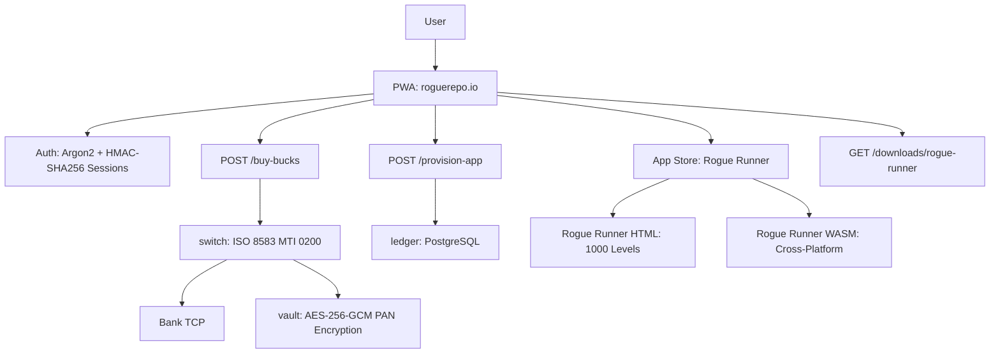

<!-- Copyright (c) 2026 The Cochran Block, LLC (Pending). All rights reserved. -->

# Proof of Artifacts

*Concrete evidence that this project works, ships, and is real.*

> Sovereign app store with ISO 8583 payment engine. No Stripe. No third-party payment processor.

## Architecture



## Build Output

| Metric | Value |
|--------|-------|
| Workspace crates | 2 (rogue-repo, rogue-runner) |
| Payment protocol | ISO 8583 MTI 0200 with bitvec bitmask packing |
| Encryption | AES-256-GCM (PAN vaulting, never plaintext in logs) |
| Auth | Argon2 password hashing + HMAC-SHA256 signed cookies |
| Database | PostgreSQL with FOR UPDATE locking (ACID transactions) |
| Economy | 100 Rogue Bucks = $1.00 USD (entry: $4.20, game: $0.42, device: $4.20) |
| Rogue Runner | 1000 procedural levels (Mulberry32 PRNG, zone-aware generation) |
| Delivery | HTML (browser), WASM (cross-platform), native binary download |

## Key Artifacts

| Artifact | Description |
|----------|-------------|
| ISO 8583 Engine | MTI 0200 built from first principles — bitvec bitmask, field encoding, bank TCP. Not a wrapper library |
| PAN Vault | AES-256-GCM with OsRng nonce. Radioactive Data policy — decrypt only for transmission |
| Rogue Bucks Ledger | PostgreSQL transactions with row-level locking. Non-destructive device registration |
| Rogue Runner Game | Procedural 1000-level platformer. Seed-based determinism. Saves to localStorage |
| PWA Shell | Service worker + manifest + embedded assets via rust-embed. Offline capable |
| Auth Stack | Argon2 (memory-hard, GPU-resistant) + email verification (24h token) + session management |
| Binary Downloads | Authenticated route streams native binaries for Windows (EXE/MSI) and Android (APK) |

## How to Verify

```bash
cargo build --release -p rogue-repo
# Visit localhost:3001 — PWA app store
# Register → Buy Bucks → Provision App → Play Rogue Runner
# All economy operations are real database transactions
```

---

*Part of the [CochranBlock](https://cochranblock.org) architecture.*
