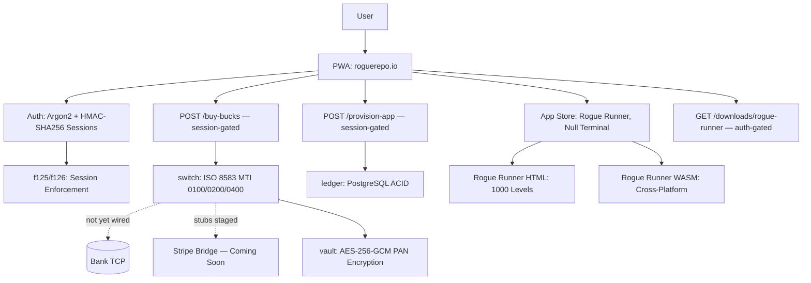

<!-- Copyright (c) 2026 The Cochran Block, LLC (Pending). All rights reserved. -->

# Proof of Artifacts

*Concrete evidence that this project works, ships, and is real.*

> Sovereign app store with ISO 8583 payment engine. Built on [CochranBlock](https://cochranblock.org) architecture.

## Architecture



Dashed lines = not yet connected. Solid lines = working.

## Build Output

| Metric | Value |
|--------|-------|
| Workspace crates | 2 (rogue-repo, rogue-runner) |
| ISO 8583 message types | 4: MTI 0100 (auth), 0200 (purchase), 0210 (response parse), 0400 (reversal) |
| ISO 8583 tests | 35 unit tests (bitvec bitmask packing, field encoding, validation) |
| Bank TCP connection | **Not yet wired** — messages build correctly but are not sent |
| Stripe bridge | **Stubs only** — mapping table + function signatures (f120-f123), no API calls |
| Encryption | AES-256-GCM (PAN vaulting, never plaintext in logs) |
| Auth | Argon2 password hashing + HMAC-SHA256 signed cookies + SESSION_SECRET enforcement (OnceLock, panics in release) |
| Session gating | f126: mutation endpoints require valid session (401) + user_id match (403) |
| Database | PostgreSQL with FOR UPDATE locking (ACID transactions) |
| Economy | 100 Rogue Bucks = $1.00 USD (entry: $4.20, game: $0.42, device: $4.20) |
| Rogue Runner | 1000 procedural levels (Mulberry32 PRNG, zone-aware generation) |
| Delivery | HTML (browser), WASM (cross-platform), native binary download (auth-gated) |
| App icons | WebP at 192x192, 85KB total (compressed from 57MB PNGs) |
| Hot reload | SO_REUSEPORT + PID lockfile — zero-downtime binary swap |
| Test coverage | 65+ tests: vault (7), ISO 8583 (35), ledger (5), HTTP (19). TRIPLE SIMS 3x determinism gate. |

## Key Artifacts

| Artifact | Status | Description |
|----------|--------|-------------|
| ISO 8583 Engine | Working | MTI 0100, 0200, 0210, 0400 built from first principles — bitvec bitmask, field encoding. No bank TCP yet. |
| Stripe Translation | Stubs | [Mapping table](rogue-repo/src/switch/stripe.rs) documenting Stripe events → ISO MTIs, decline codes → response codes. Function signatures f120-f123. No implementation. |
| PAN Vault | Working | AES-256-GCM with OsRng nonce. Radioactive Data policy — decrypt only for transmission. |
| Rogue Bucks Ledger | Working | PostgreSQL transactions with row-level locking. Credit, debit, balance check, entitlement tracking. |
| Session Enforcement | Working | f125 (OnceLock startup check, panics release if SESSION_SECRET missing). f126 (require_session, 401/403 on mutation routes). |
| Rogue Runner Game | Playable | 1000-level procedural platformer. Deterministic PRNG. HTML canvas + WASM + native binary. |
| Null Terminal | Playable | Hacker sim. HTML-based. |
| PWA Shell | Working | Service worker + manifest + WebP icons via rust-embed. Offline capable. Login/Logout nav toggle. |
| Auth Stack | Working | Argon2 (memory-hard) + email verification (24h token via Resend) + HMAC-SHA256 session cookies. |
| Binary Downloads | Working | Auth-gated route streams native binaries for Windows (EXE/MSI) and Android (APK). |

## What's Coming

| Feature | Dependency | Link |
|---------|------------|------|
| Game catalog (8 titles) | Pixel Forge pixel art AI model | [github.com/cochranblock/pixel-forge](https://github.com/cochranblock/pixel-forge) |
| Stripe payment bridge | ISO 8583 switch + Stripe API integration | [Stripe stubs](rogue-repo/src/switch/stripe.rs) |
| Bank TCP connection | Payment processor integration | ISO 8583 wire encoding ready |

## How to Verify

```bash
cp .env.example .env
# Set DATABASE_URL and SESSION_SECRET (>= 32 chars)
sqlx migrate run
cargo build --release -p rogue-repo
cargo run -p rogue-repo --release
# Visit localhost:3001 — PWA app store
# Register → Verify email → Login → see nav toggle
# POST /buy-bucks without session → 401
# All economy operations are real database transactions
```

```bash
# Run full test suite
cargo run -p rogue-repo --bin rogue-repo-test --features tests   # EXIT 0 = pass
cargo run -p rogue-runner --bin rogue-runner-test --features tests # EXIT 0 = pass
```

---

*Part of the [CochranBlock](https://cochranblock.org) architecture.*
