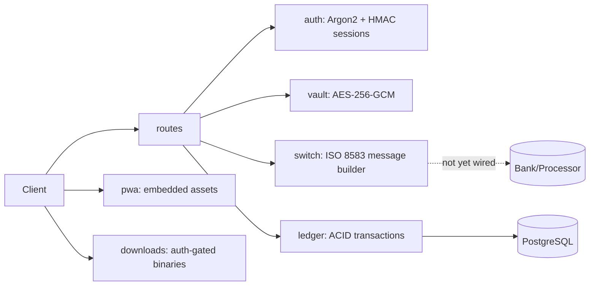

<!-- Copyright (c) 2026 The Cochran Block, LLC (Pending). All rights reserved. -->
<!-- Contributors: GotEmCoach, KOVA, Claude Opus 4.6, SuperNinja, Composer 1.5, Google Gemini Pro 3 -->

> **It's not the Mech — it's the pilot.**
>
> This repo is part of [CochranBlock](https://cochranblock.org) — Rust repositories powering an entire company on a **single <10MB binary**, a laptop, and a **$10/month** Cloudflare tunnel. No AWS. No Kubernetes. No six-figure DevOps team. Zero cloud.
>
> **[cochranblock.org](https://cochranblock.org)** is a live demo of this architecture.
>
> Every repo ships with **[Proof of Artifacts](PROOF_OF_ARTIFACTS.md)** (wire diagrams, screenshots, and build output proving the work is real) and a **[Timeline of Invention](TIMELINE_OF_INVENTION.md)** (dated commit-level record of what was built, when, and why — proving human-piloted AI development, not generated spaghetti).
>
> **Looking to cut your server bill by 90%?** → [Zero-Cloud Tech Intake Form](https://cochranblock.org/deploy)

---

<p align="center">
  
</p>

# Rogue Repo

Sovereign software repository and ISO 8583 payment engine. 100% Rust.

## What Works Today

| Component | Status | Details |
|-----------|--------|---------|
| **PWA App Store** | Working | Embedded HTML/CSS served from Rust. Zero client JS for app logic. Dark theme, offline-first via service worker. |
| **Auth** | Working | Argon2id password hashing, HMAC-SHA256 signed session cookies (7-day TTL), email verification via Resend. Session-gated mutation endpoints (401/403). |
| **Vault** | Working | AES-256-GCM encryption for PAN data. Nonces via OsRng. Plaintext never logged. |
| **Ledger** | Working | PostgreSQL with ACID transactions, `FOR UPDATE` row locking. Credit bucks, debit for games/devices, balance checks. |
| **ISO 8583 Message Builder** | Working | Builds MTI 0100 (auth), 0200 (purchase), 0400 (reversal). Parses MTI 0210 (response). Bitmap packing via bitvec. 35 unit tests. |
| **Hot Reload** | Working | SO_REUSEPORT + PID lockfile. Zero-downtime binary swap. |
| **Rogue Runner** | Playable | 1000 procedural levels, deterministic PRNG. HTML canvas + WASM + native (macroquad). |
| **Null Terminal** | Playable | Hacker sim, HTML-based. |
| **Binary Delivery** | Working | Auth-gated downloads for Windows EXE/MSI, Android APK. |

## What Doesn't Work Yet

| Component | Status | Blocker |
|-----------|--------|---------|
| **Bank/Switch TCP** | Ready, not connected | TCP client wired (f127/f128/f129). Set `SWITCH_HOST` + `SWITCH_PORT` to connect to a bank/processor. Length-prefixed ISO 8583 wire protocol. Graceful fallback when not configured — credits bucks with warning. |
| **Stripe Bridge** | Stubs only | [Mapping table and function signatures staged](rogue-repo/src/switch/stripe.rs) (f120-f123). No actual Stripe API calls. No webhook verification. |
| **Rogue Bucks Purchase** | Incomplete | Depends on bank/switch TCP or Stripe bridge. Ledger works; payment doesn't. |
| **Game Catalog (8 titles)** | Blocked | Waiting on [Pixel Forge](https://github.com/cochranblock/pixel-forge) — all game assets will be AI-generated by our own pixel art model. This is a dependency, not a delay. |

## Architecture



Dashed line = not yet connected.

## Workspace Crates

| Crate | Description |
|-------|-------------|
| **rogue-repo** | Axum HTTP API + PWA app store for roguerepo.io |
| **rogue-runner** | 1000-level endless runner (macroquad, cross-platform) |

### rogue-repo Modules

- **auth** (`src/auth.rs`): Argon2 passwords, HMAC-SHA256 sessions, email verification, session enforcement (f125, f126)
- **vault** (`src/vault/`): AES-256-GCM PAN encryption (Radioactive Data policy — plaintext never logged)
- **switch** (`src/switch/`): ISO 8583 message builder — MTI 0100, 0200, 0210, 0400. Wire encoding works. No bank connection yet.
- **switch/stripe** (`src/switch/stripe.rs`): Stripe-to-ISO 8583 mapping table + stubs (f120-f123). Not functional.
- **ledger** (`src/ledger/`): PostgreSQL — users, devices, entitlements, Rogue Bucks balance
- **routes** (`src/routes.rs`): Authenticated endpoints — `/buy-bucks`, `/provision-app`, `/add-device`, `/health`
- **pwa** (`src/pwa.rs`): Embedded PWA shell, manifest, service worker, app pages
- **downloads** (`src/downloads.rs`): Auth-gated binary delivery (Windows EXE/MSI, Android APK)

## Routes

| Method | Path | Auth | Description |
|--------|------|------|-------------|
| GET | `/` | No | PWA app store index (shows Login or Logout based on session) |
| GET | `/health` | No | Health check (`{"ok": true}`) |
| GET | `/login` | No | Login page |
| POST | `/login` | No | Login (Argon2 verify + session cookie) |
| GET | `/register` | No | Registration page |
| POST | `/register` | No | Register (Argon2 hash + email verification) |
| GET | `/verify-email` | No | Email verification callback |
| POST/GET | `/logout` | No | Clear session cookie |
| POST | `/buy-bucks` | **Yes** | Purchase Rogue Bucks (ISO 8583 message built, bank send pending) |
| POST | `/provision-app` | **Yes** | Provision game entitlement (42 bucks) |
| POST | `/add-device` | **Yes** | Register device (420 bucks) |
| GET | `/apps/rogue-runner` | No | Rogue Runner HTML game |
| GET | `/apps/rogue-runner-wasm` | No | Rogue Runner WASM build |
| GET | `/apps/null-terminal` | No | Null Terminal hacker sim |
| GET | `/downloads/rogue-runner` | Yes | Auth-gated binary download |
| GET | `/manifest.json` | No | PWA manifest |
| GET | `/sw.js` | No | Service worker |
| GET | `/assets/*` | No | Static assets (WebP icons, SVGs) |

## Rogue Bucks Economy

| Item | Amount |
|------|--------|
| 100 Rogue Bucks | $1.00 USD |
| Entry buy-in | $4.20 (420 bucks) |
| Game download | 42 bucks |
| Add device fee | 420 bucks |

Ledger operations work (credit, debit, balance check). Actual payment collection not yet wired.

## Quick Start

```bash
cp .env.example .env
# Edit .env — set DATABASE_URL and SESSION_SECRET (>= 32 chars)
sqlx migrate run
cargo run -p rogue-repo          # starts on port 3001
```

See [.env.example](.env.example) for all configuration options.

## Build

```bash
cargo build -p rogue-repo
cargo build -p rogue-runner
```

## Test

```bash
cargo run -p rogue-repo --bin rogue-repo-test --features tests
cargo run -p rogue-runner --bin rogue-runner-test --features tests
```

Exit 0 = pass, 1 = fail. TRIPLE SIMS gate (3x sequential `cargo test` for determinism) via exopack.

**Test coverage:** 88+ tests — vault encryption (7), ISO 8583 message builder (35), Stripe mapping (6), ledger transactions (5), HTTP routes (20), rogue-runner game logic (17).

## Tokenization

This codebase uses compressed identifiers (f#, t#, s#) for AI-context optimization. See `rogue-repo/compression_map.md` for the full mapping. Example: `f87` = `serve_buy_bucks`, `t2` = `PurchaseRequest`.

## Methodology

Documentation accuracy is enforced via **P23 (Triple Lens Research Protocol)** — architecture decisions and status claims are analyzed from optimist, pessimist, and paranoia perspectives before being committed. "What Works" and "What Doesn't" tables are verified against code. Coming Soon features link to their blocking dependency so visitors can follow the chain.
