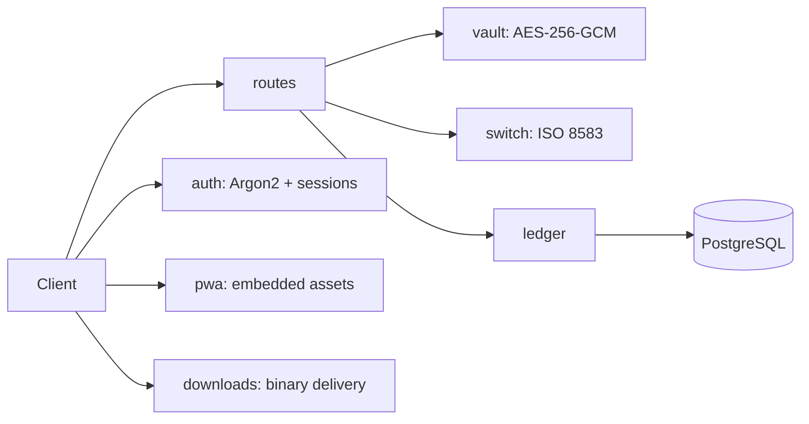

<!-- Copyright (c) 2026 The Cochran Block, LLC (Pending). All rights reserved. -->
<!-- Contributors: GotEmCoach, KOVA, Claude Opus 4.6, SuperNinja, Composer 1.5, Google Gemini Pro 3 -->

> **It's not the Mech — it's the pilot.**
>
> This repo is part of [CochranBlock](https://cochranblock.org) — Rust repositories powering an entire company on a **single <10MB binary**, a laptop, and a **$10/month** Cloudflare tunnel. No AWS. No Kubernetes. No six-figure DevOps team. Zero cloud.
>
> **[cochranblock.org](https://cochranblock.org)** is a live demo of this architecture.
>
> Every repo ships with **[Proof of Artifacts](PROOF_OF_ARTIFACTS.md)** (wire diagrams, screenshots, and build output proving the work is real) and a **[Timeline of Invention](TIMELINE_OF_INVENTION.md)** (dated commit-level record of what was built, when, and why — proving human-piloted AI development, not generated spaghetti).
>
> **Looking to cut your server bill by 90%?** → [Zero-Cloud Tech Intake Form](https://cochranblock.org/deploy)

---

<p align="center">
  
</p>

# Rogue Repo

Sovereign, high-security software repository and ISO 8583 payment engine. 100% Rust.

## Proof of Artifacts

*Wire diagrams for quick review.*

### Wire / Architecture



---

## Workspace Crates

| Crate | Description |
|-------|-------------|
| **rogue-repo** | Axum HTTP API + PWA app store for roguerepo.io |
| **rogue-runner** | 1000-level endless runner (macroquad, cross-platform) |

### rogue-repo Modules

- **vault** (`src/vault/`): AES-256-GCM encryption, PAN vaulting (Radioactive Data policy)
- **switch** (`src/switch/`): ISO 8583 MTI 0200 engine, bitmask packing
- **ledger** (`src/ledger/`): PostgreSQL — users, devices, entitlements, Rogue Bucks balance
- **routes** (`src/routes.rs`): `/buy-bucks`, `/provision-app`, `/add-device`, `/health`
- **auth** (`src/auth.rs`): Argon2 password hashing, HMAC-SHA256 signed cookies, email verification via Resend
- **pwa** (`src/pwa.rs`): Embedded PWA shell (rust-embed), manifest, service worker, app pages
- **downloads** (`src/downloads.rs`): Auth-gated binary delivery (Windows EXE/MSI, Android APK)

## Routes

| Method | Path | Handler | Description |
|--------|------|---------|-------------|
| GET | `/` | f4 | PWA app store index |
| GET | `/health` | f5 | Health check |
| GET | `/login` | f102 | Login page |
| POST | `/login` | f98 | Login (Argon2 verify + session cookie) |
| GET | `/register` | f103 | Registration page |
| POST | `/register` | f97 | Register (Argon2 hash + email verification) |
| GET | `/verify-email` | f100 | Email verification callback |
| POST/GET | `/logout` | f101 | Clear session cookie |
| POST | `/buy-bucks` | f87 | Purchase Rogue Bucks (ISO 8583 placeholder) |
| POST | `/provision-app` | f88 | Provision game entitlement (42 bucks) |
| POST | `/add-device` | f89 | Register device (420 bucks) |
| GET | `/apps/rogue-runner` | f94 | Rogue Runner HTML game |
| GET | `/apps/rogue-runner-wasm` | f95 | Rogue Runner WASM build |
| GET | `/apps/null-terminal` | f117 | Null Terminal hacker sim |
| GET | `/downloads/rogue-runner` | f118 | Auth-gated binary download |
| GET | `/manifest.json` | f92 | PWA manifest |
| GET | `/sw.js` | f93 | Service worker |
| GET | `/assets/*` | f91 | Static assets |

## Rogue Bucks Economy

| Item | Amount |
|------|--------|
| 100 Rogue Bucks | $1.00 USD |
| Entry buy-in | $4.20 (420 bucks) |
| Game download | 42 bucks |
| Add device fee | 420 bucks |

## Build

```bash
cargo build -p rogue-repo
cargo build -p rogue-runner
cargo run -p rogue-repo          # starts on port 3001
```

## Test

```bash
cargo run -p rogue-repo --bin rogue-repo-test --features tests
cargo run -p rogue-runner --bin rogue-runner-test --features tests
```

Exit 0 = pass, 1 = fail. TRIPLE SIMS gate via exopack.

## Database

PostgreSQL. Run migrations:

```bash
sqlx migrate run
```

Set `DATABASE_URL` in `.env`.

## Tokenization

See `rogue-repo/compression_map.md` for identifier mapping.
