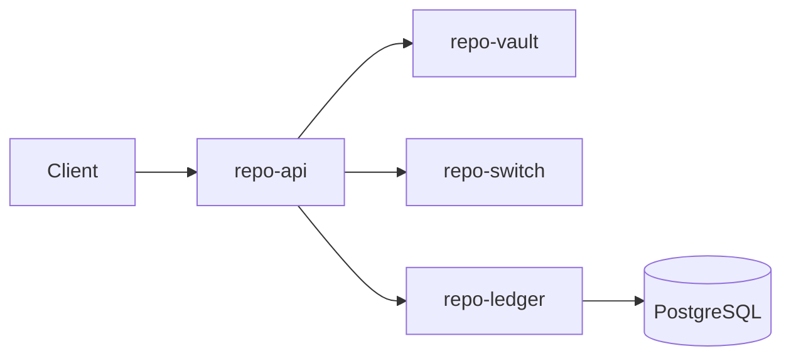

<!-- Copyright (c) 2026 The Cochran Block, LLC (Pending). All rights reserved. -->
<!-- Contributors: GotEmCoach, KOVA, Claude Opus 4.6, SuperNinja, Composer 1.5, Google Gemini Pro 3 -->

> **It's not the Mech — it's the pilot.**
>
> This repo is part of [CochranBlock](https://cochranblock.org) — Rust repositories powering an entire company on a **single <10MB binary**, a laptop, and a **$10/month** Cloudflare tunnel. No AWS. No Kubernetes. No six-figure DevOps team. Zero cloud.
>
> **[cochranblock.org](https://cochranblock.org)** is a live demo of this architecture.
>
> Every repo ships with **[Proof of Artifacts](PROOF_OF_ARTIFACTS.md)** (wire diagrams, screenshots, and build output proving the work is real) and a **[Timeline of Invention](TIMELINE_OF_INVENTION.md)** (dated commit-level record of what was built, when, and why — proving human-piloted AI development, not generated spaghetti).
>
> **Looking to cut your server bill by 90%?** → [Zero-Cloud Tech Intake Form](https://cochranblock.org/deploy)

---

<p align="center">
  
</p>

# Rogue Repo

Sovereign, high-security software repository and ISO 8583 payment engine. 100% Rust.

## Proof of Artifacts

*Wire diagrams for quick review.*

### Wire / Architecture



---

## Workspace Crates

- **repo-vault**: AES-256-GCM encryption, PAN vaulting (Radioactive Data policy)
- **repo-switch**: ISO 8583 MTI 0200 engine, bitmask packing, bank TCP
- **repo-ledger**: PostgreSQL source of truth — users, devices, entitlements
- **repo-api**: Axum API — `/buy-bucks`, `/provision-app`, `/add-device`

## Rogue Bucks Economy

| Item | Amount |
|------|--------|
| 100 Rogue Bucks | $1.00 USD |
| Entry buy-in | $4.20 (420 bucks) |
| Game download | 42 bucks |
| Add device fee | 420 bucks |

## Build

```bash
cargo build
cargo run -p repo-api
```

## Test

```bash
cargo run -p repo-api -- --test
```

Runs f49 (unit), f50 (integration), f51 (HTTP). Exit 0 = pass, 1 = fail.

## Database

PostgreSQL. Run migrations:

```bash
sqlx migrate run
```

Set `DATABASE_URL` in `.env`.

## Tokenization

See `rogue-repo/compression_map.md` for identifier mapping.
